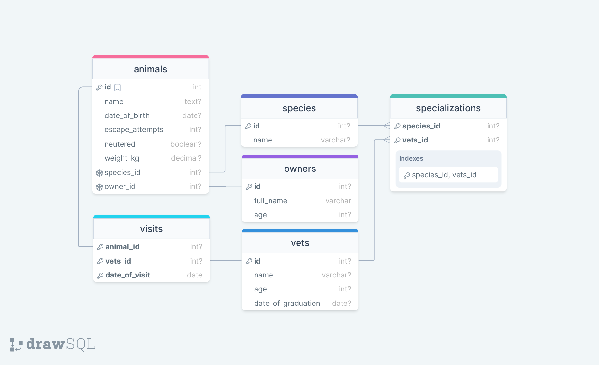

  
   

<!-- TABLE OF CONTENTS -->

# 📗 Table of Contents

- [📖 About the Project](#about-project)
  - [🛠 Built With](#built-with)
    - [Tech Stack](#tech-stack)
  - [Documentation](#documentation)
- [💻 Getting Started](#getting-started)
- [👥 Authors](#authors)
- [🤝 Contributing](#contributing)
- [⭐️ Show your support](#support)
- [🙏 Acknowledgements](#acknowledgements)
- [📝 License](#license)

<!-- PROJECT DESCRIPTION -->

# 📖 Vet-clinic first SQL project

## 🛠 Built With 

### Tech Stack 

  <li><a href="https://www.postgresql.org/">postgreSQL</a></li>

(<a href="#readme-top">back to top</a>)

## 🚀 Project Documentation 

In this project I created the database of an imaginary vet clinic. There are tables for animals, species of animals, vets, specializations of vets, owners, and visits to vets. In the documentation queries.sql we can find some pre-written queries to get some detailed information. The below diagram represents the database: 

 

(<a href="#readme-top">back to top</a>)

<!-- GETTING STARTED -->

##  Getting Started 

To get a local copy up and running, follow these steps.

### Prerequisites

In order to run this project you need:

- GitHub access
- A code editor

### Setup

## 💻 Getting Started

This repository includes files with plain SQL that can be used to recreate a database:

- Use [schema.sql](./schema.sql) to create all tables.
- Use [data.sql](./data.sql) to populate tables with sample data.
- Check [queries.sql](./queries.sql) for examples of queries that can be run on a newly created database. **Important note: this file might include queries that make changes in the database (e.g., remove records). Use them responsibly!**

<!-- AUTHORS -->

## 👥 Author 

👤 **Author**

- GitHub: [@MattGomb](https://github.com/MattGomb)
- Twitter: [@MtysGombos1](https://twitter.com/MtysGombos1)
- LinkedIn: [LinkedIn](https://www.linkedin.com/in/gombos-matyas/)

(<a href="#readme-top">back to top</a>)

<!-- FUTURE FEATURES -->

<!-- CONTRIBUTING -->

## 🤝 Contributing 

Contributions, issues, and feature requests are welcome!

Feel free to check the [issues page](../../issues/).

(<a href="#readme-top">back to top</a>)

<!-- SUPPORT -->

## ⭐️ Show your support 

If you like this project please give it a star!

(<a href="#readme-top">back to top</a>)

<!-- ACKNOWLEDGEMENTS -->

## 🙏 Acknowledgments 

(<a href="#readme-top">back to top</a>)

<!-- LICENSE -->

## 📝 License 

This project is [MIT](./LICENSE) licensed.

(<a href="#readme-top">back to top</a>)

